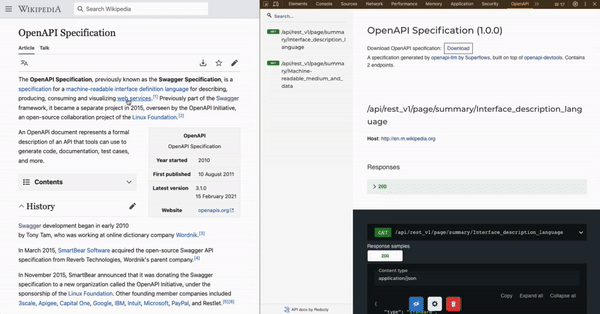

[![MIT License][license-shield]][license-url]

<!-- PROJECT LOGO -->

  

 

 Generate a OpenAPI Specification in real time for any app or website, including descriptions of endpoints and parameters.

 

A browser extension that discovers API behaviour via your interactions with a product or website, and then uses an LLM to describe the API endpoints discovered.

 

This project is a fork of OpenAPI Devtools. Check out the <a href="https://github.com/AndrewWalsh/openapi-devtools"> original tool here. </a>

 

The <a href="https://www.superflows.ai/"> Superflows </a> team extended the functionality of the original tool after building AI assistants using OpenAPI specifications. We found it useful to have natural language descriptions in OpenAPI Specifications, both for human understanding and to increasing the reliability of AI assistants using them to make API calls (also recommended elsewhere, such as by [Anthropic](https://docs.anthropic.com/en/docs/tool-use#best-practices-for-tool-definitions)). 

## About The Project

    

OpenAPI-LLM is built on top of the OpenAPI DevTools browser extension that generates OpenAPI specifications in real time from network requests. Once installed it adds a new tab to DevTools called `OpenAPI`. While the tool is running, it automatically converts network requests into a specification. You can then select endpoints you would like to have a natural language descriptions for, and generate descriptions of endpoints and parameters. 

We customised this for the use case of feeding these OpenAPI Specifications to LLMs or AI agents. LLMs and AI typically require thorough descriptions of endpoints to use them well. 

*Features*:
- Instantly generate an OpenAPI 3.1 specification for any website or application just by using it
- Automatically merges new request & response headers, bodies, and query parameters per endpoint
- Click on a [path parameter](https://www.abstractapi.com/api-glossary/path-parameters) and the app will automatically merge existing and future matching requests
- View the specification inside the tool using [Redoc](https://www.npmjs.com/package/redoc) and download with a click
- Describe endpoints of your choosing and their parameters using OpenAI's GPT4

(<a href="#readme-top">back to top</a>)

## Installation

    

This version of the browser extension is not currently available in the webstores. The original version is without the ability to add natural language descriptions is avaiable on webstores, you can [find it here](https://github.com/AndrewWalsh/openapi-devtools). If there is significant interest, we will add this version to webstores in future.

To install manually (Chrome):
  - [Download and extract the dist-chrome.zip file in the latest release](https://github.com/Superflows-AI/openapi-llm/releases/latest/download/dist-chrome.zip)
  - In Chrome, navigate to `chrome://extensions`
  - In the top right enable the `Developer mode` toggle
  - In the top left click `Load unpacked` and select the extracted `dist` directory
  - Open a new tab and then select `OpenAPI` in the developer tools (open with `cmd+i` or `ctrl+i`)

  To install manually (Firefox):
  - [Download and extract the dist-firefox.zip file in the latest release](https://github.com/Superflows-AI/openapi-llm/releases/latest/download/dist-firefox.zip)
  - In Firefox, navigate to `about:debugging#/runtime/this-firefox`
  - In the top right enable click `Load Temporary Add-on...` toggle
  - Navigate to the extracted `dist` folder and select and open `index.html`
  - Open a new tab and then select `OpenAPI` in the developer tools

(<a href="#readme-top">back to top</a>)

## Usage

- Once in the `OpenAPI` tool in developer tools, click start recording
- Click on the product API you would like to document. You will see the OpenAPI spec populating.
- Once you have populated the OpenAPI Spec, click the settings cog at the bottom of the OpenAPI window
- Enter your OpenAI key. This is stored locally.
- Select the endpoints you would like to add natural language descriptions to
- Click 'Describe Endpoints' point, and wait for LLMs to work their magic
- Return to the OpenAPI spec viewing page to see descriptions, and click `download spec` once you're happy

The specification automatically populates based on JSON requests that fire as you browse the web. 

In the settings menu you can enter your OpenAI API key and select which endpoints you would like to describe. Once described, the descriptions will be placed into the OpenAPI Spec next to the relevant endpoint or parameter.  

You can also filter hosts and parameterise paths in URLs. Once you do so all matching existing and future requests to that endpoint will be merged. This process is irreversible, but you can clear the specification and restart at any time.

When the same endpoint responds with different data, such as a value that is sometimes a string and sometimes null, the specification for that value will be *either* string or null. All information is accounted for in the final specification. If you see something missing from a request, trigger a request that contains the missing information.

The settings menu contains several options. Here you can enable real examples in the specification. You can also export the current state of the app as a string, share or store it, and import it later.

(<a href="#readme-top">back to top</a>)

## What is OpenAPI?

An [OpenAPI](https://www.openapis.org/) specification is a description of what an API expects to receive and what it will respond with. It is governed by the OpenAPI Initiative and the Linux Foundation. OpenAPI specifications are the modern standard for RESTful APIs, and systems that have them are far easier to work with.

(<a href="#readme-top">back to top</a>)

## Contributing

To develop the project:
- `npm install`
- If developing in Chrome:
  - `npm run dev`
- If developing in Firefox:
  - `npm run build-firefox`
  - `npm run dev`

(<a href="#readme-top">back to top</a>)

<!-- MARKDOWN LINKS & IMAGES -->
<!-- https://www.markdownguide.org/basic-syntax/#reference-style-links -->
[license-url]: https://github.com/AndrewWalsh/openapi-devtools/blob/main/LICENSE.txt
[license-shield]: https://img.shields.io/github/license/AndrewWalsh/openapi-devtools.svg?style=for-the-badge
